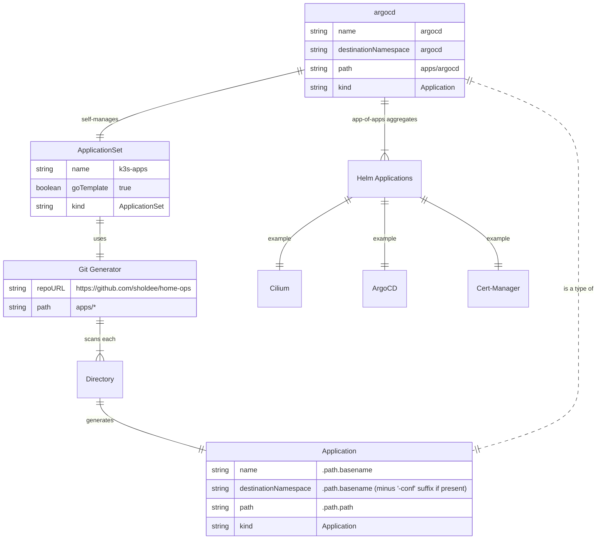

# K3s Home Operations

...managed with 
🤖 ArgoCD, Renovate, and GitHub Actions 🤖

&nbsp;&nbsp;

&nbsp;&nbsp;
&nbsp;&nbsp;

&nbsp;&nbsp;
&nbsp;&nbsp;
&nbsp;&nbsp;
&nbsp;&nbsp;
&nbsp;&nbsp;
&nbsp;&nbsp;

## Overview 📔

This repository contains the configurations for my home operations k3s cluster.

My applications are managed in GitOps fashion with ArgoCD, Renovate, and Github webhooks. Repository push events trigger a webhook to ArgoCD, causing it to immediately sync the cluster state with this repository.

Renovate continuously scans the repository and submits pull requests for dependency updates. This includes upgrades to K3s itself via [system-upgrade-controller](https://github.com/rancher/system-upgrade-controller).

Pull requests for Helm application updates trigger a workflow to calculate and post the diff between the old and new versions' inflated manifests, as well as detect and pull all new container images to the cluster for verification.

Container image update pull requests against base manifests in the repository also trigger a workflow to pull the new image. This has the added benefit of caching all images in the local embedded registry mirror, Spegel, prior to merging.

### ArgoCD Project Structure 🏗️

The project utilizes ArgoCD's `ApplicationSet` custom resource with a Git directory generator, watching `apps/*`, to dynamically create all ArgoCD `Application` instances. It is self-managing and contained within the special `argocd` application, which is also an app-of-apps holding Helm applications.

### Primary Applications ⭐

- Home Assistant and related services
  - Appdaemon
    - Custom [automations](https://github.com/sholdee/sholdee-hass-apps)
  - Z-Wave JS UI
  - HiveMQ
  - Codeserver
  - Venstar MQTT bridge
- Unifi
- Adguard
  - Custom [exporter sidecar](https://github.com/sholdee/adguard-exporter)
- Gravity DNS cluster
  - External-DNS webhook
  - etcd
- Renovate
- Portainer
  - GitOps for remote Docker hosts

### Core Components 🔥

- ArgoCD
- 1Password Connect
- External-Secrets
- External-DNS
- Envoy Gateway
- Cert-Manager
- Kube-VIP
- VolSync
- CloudNativePG
- MongoDB Controllers for Kubernetes
- Kube Prometheus Stack
- Kromgo
- System Upgrade Controller
- Kubernetes Dashboard
- Stakater Reloader
- Velero

### Network: Cilium 🕸️

- Gateway API
- Netkit
- eBPF host-routing
- Native routing
- BGP control plane
- Hubble observability

### Storage: Longhorn 💾

### Hardware 🖥️

- RPi 5 with 512GB NVMe SSD via PCIe hat
