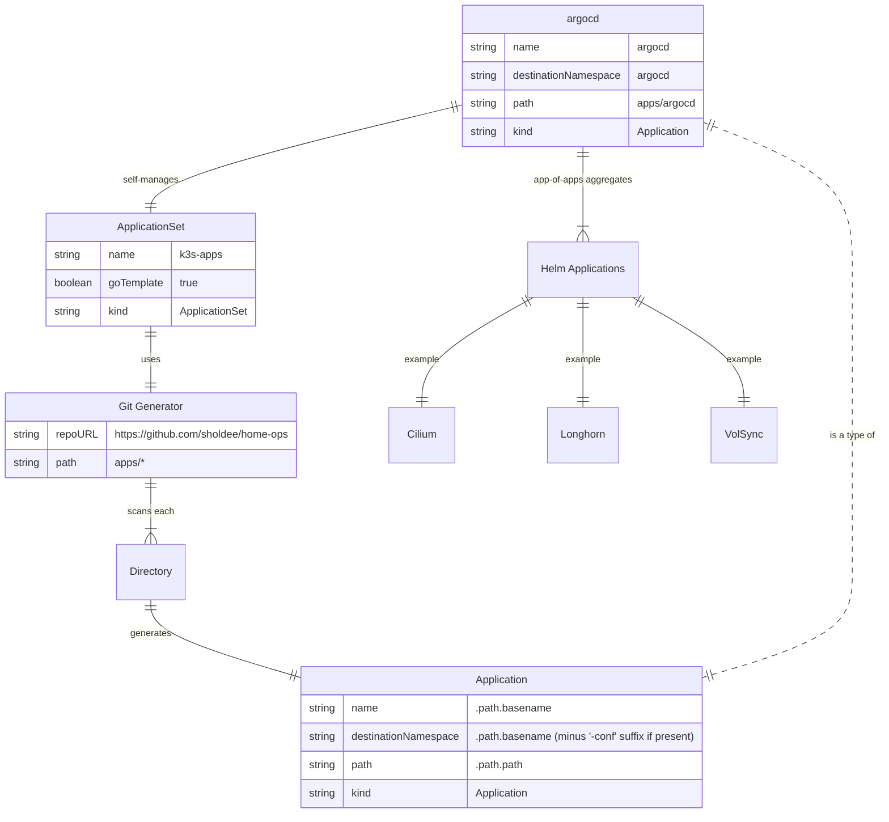

<div align="center">

# K3s Home Operations

...managed with<br />
🤖 ArgoCD, Renovate, and GitHub Actions 🤖

</div>

<div align="center">

[](https://k3s.io/)&nbsp;&nbsp;

</div>

<div align="center">

[](https://healthchecks.io)&nbsp;&nbsp;
[](https://healthchecks.io)&nbsp;&nbsp;

</div>

<div align="center">

[](https://github.com/kashalls/kromgo/)&nbsp;&nbsp;
[](https://github.com/kashalls/kromgo/)&nbsp;&nbsp;
[](https://github.com/kashalls/kromgo/)&nbsp;&nbsp;
[](https://github.com/kashalls/kromgo/)&nbsp;&nbsp;
[](https://github.com/kashalls/kromgo/)&nbsp;&nbsp;
[](https://github.com/kashalls/kromgo/)&nbsp;&nbsp;

</div>

## Overview 📔

This repository contains the configurations for my home operations k3s cluster.

My applications are managed in GitOps fashion with ArgoCD, Renovate, and Github webhooks. Repository push events trigger a webhook to ArgoCD, causing it to immediately sync the cluster state with this repository.

Renovate continuously scans the repository and submits pull requests for dependency updates. This includes upgrades to K3s itself via [system-upgrade-controller](https://github.com/rancher/system-upgrade-controller).

Pull requests for Helm application updates trigger a workflow to calculate and post the diff between the old and new versions' inflated manifests, as well as detect and pull all new container images to the cluster for ARM64 platform verification.

Container image update pull requests against base manifests in the repository also trigger a workflow to pull the new image and verify ARM64 compatibility. This has the added benefit of caching all images in the local embedded registry mirror, Spegel, prior to merging.

### Repository Structure 📂

```
apps/              # Application definitions -- one ArgoCD Application per directory
├── argocd/        # Self-managing ArgoCD + ApplicationSet + app-of-apps Helm charts
├── hass/          # Grouped: Home Assistant, Appdaemon, Z-Wave, Codeserver, CNPG, MQTT bridge
├── unifi/         # Grouped: UniFi controller, MongoDB ReplicaSet, guest portal proxy
├── monitoring/    # Grouped: kube-prometheus-stack, Grafana, Prometheus, Alertmanager, Kromgo
├── kube-system/   # Grouped: Cilium BGP config, kube-vip, external-snapshotter
└── .../           # Each remaining directory is a standalone app (Helm or plain manifests)
components/        # Reusable Kustomize Components (namespace pull secrets, VolSync backup templates)
docs/              # Operational documentation
.github/           # Renovate config, CI workflows, helper scripts
```

### ArgoCD Project Structure 🏗️

The project utilizes ArgoCD's `ApplicationSet` custom resource with a Git directory generator, watching `apps/*`, to dynamically create all ArgoCD `Application` instances. It is self-managing and contained within the special `argocd` application, which is also an app-of-apps holding Helm applications.


```mermaid
erDiagram
    ApplicationSet {
      string name "k3s-apps"
      boolean goTemplate "true"
      string kind "ApplicationSet"
    }
    "Git Generator" {
      string repoURL "https:&sol;&sol;github&period;com/sholdee/home-ops"
      string path "apps/*"
    }
    Directory
    Application {
      string name ".path.basename"
      string destinationNamespace ".path.basename (minus '-conf' suffix if present)"
      string path ".path.path"
      string kind "Application"
    }
    argocd {
      string name "argocd"
      string destinationNamespace "argocd"
      string path "apps/argocd"
      string kind "Application"
    }
    "Helm Applications"
    Cilium
    Longhorn
    VolSync

    ApplicationSet ||--|| "Git Generator" : "uses"
    "Git Generator" ||--|{ Directory : "scans each"
    Directory ||--|| Application : "generates"
    argocd ||..|| Application : "is a type of"
    argocd ||--|{ "Helm Applications" : "app-of-apps aggregates"
    "Helm Applications" ||--|| Cilium : "example"
    "Helm Applications" ||--|| Longhorn : "example"
    "Helm Applications" ||--|| VolSync : "example"
    argocd ||--|| ApplicationSet : "self-manages"
```

### Primary Applications ⭐

- Home Assistant and related services
  - Appdaemon
    - Custom [automations](https://github.com/sholdee/sholdee-hass-apps)
  - Z-Wave JS UI
  - Codeserver
  - Venstar MQTT bridge
- HiveMQ
- Mealie
- Unifi
- Adguard
  - Custom [exporter sidecar](https://github.com/sholdee/adguard-exporter)
- PowerDNS Authoritative DNS
  - dnsdist (DNS load balancer/router)
  - Poweradmin (web UI)
  - CNPG PostgreSQL with pgbouncer
- Renovate
- Portainer
  - GitOps for remote Docker hosts

### Core Components 🔥

- ArgoCD
- 1Password Connect
- External-Secrets
- External-DNS
- Envoy Gateway
- Cert-Manager
- Kube-VIP
- VolSync
- CloudNativePG
- HiveMQ Platform Operator
- MongoDB Controllers for Kubernetes
- Kube Prometheus Stack
- Kromgo
- System Upgrade Controller
- Headlamp
- Stakater Reloader
- Velero

### Network: Cilium 🕸️

- Gateway API
- Netkit
- eBPF host-routing
- Native routing
- BGP control plane
- Hubble observability

### Storage: Longhorn 💾

- VolSync with Restic to Backblaze B2
- CloudNativePG barman-cloud to Backblaze B2
- Longhorn recurring backups to NAS (NFS)
- Velero cluster-wide backup

### Hardware 🖥️

| Node | Role | RAM | Storage |
|---|---|---|---|
| k3s-master-0 | Control plane | 16GB | 512GB NVMe SSD |
| k3s-master-1 | Control plane | 16GB | 512GB NVMe SSD |
| k3s-master-2 | Control plane | 16GB | 512GB NVMe SSD |
| k3s-worker-0 | Worker | 8GB | 512GB NVMe SSD |
| k3s-worker-1 | Worker | 8GB | 512GB NVMe SSD |

All nodes are Raspberry Pi 5 with NVMe SSD via PCIe hat.
