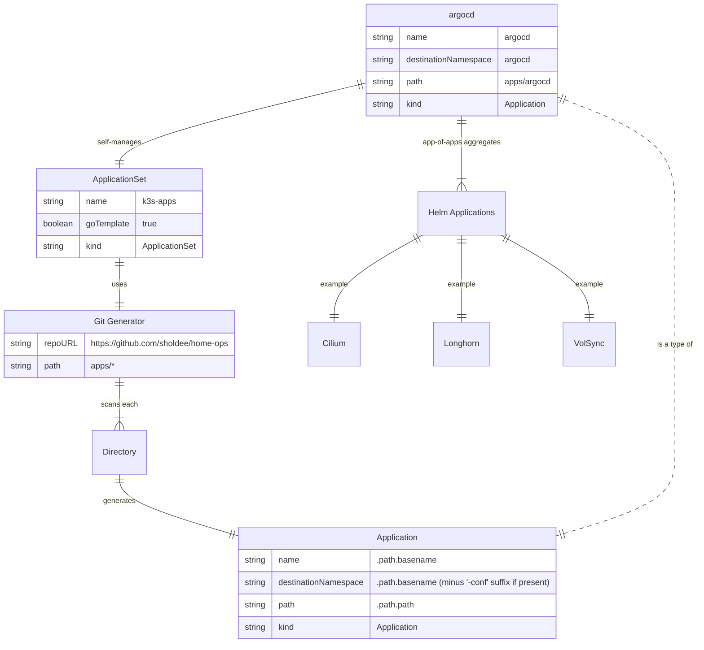

<div align="center">

# K3s Home Operations

...managed with<br />
🤖 ArgoCD, Renovate, and GitHub Actions 🤖

</div>

<div align="center">

[](https://k3s.io/)&nbsp;&nbsp;

</div>

<div align="center">

[](https://healthchecks.io)&nbsp;&nbsp;
[](https://healthchecks.io)&nbsp;&nbsp;

</div>

<div align="center">

[](https://github.com/kashalls/kromgo/)&nbsp;&nbsp;
[](https://github.com/kashalls/kromgo/)&nbsp;&nbsp;
[](https://github.com/kashalls/kromgo/)&nbsp;&nbsp;
[](https://github.com/kashalls/kromgo/)&nbsp;&nbsp;
[](https://github.com/kashalls/kromgo/)&nbsp;&nbsp;
[](https://github.com/kashalls/kromgo/)&nbsp;&nbsp;

</div>

## Overview 📔

This repository contains the configurations for my home operations k3s cluster.

My applications are managed in GitOps fashion with ArgoCD, Renovate, and GitHub webhooks. Repository push events trigger a webhook to ArgoCD, causing it to immediately sync the cluster state with this repository.

Renovate continuously scans the repository and submits pull requests for dependency updates. This includes upgrades to K3s itself via [system-upgrade-controller](https://github.com/rancher/system-upgrade-controller).

A unified CI pipeline runs on all pull requests, conditionally triggering the appropriate checks:

- **Helm updates** — diffs inflated manifests between old and new versions, pulls new container images to verify ARM64 compatibility
- **Image updates** — pulls the new image and verifies ARM64 platform support
- **Pre-commit** — validates YAML syntax, Kubernetes schemas, and code quality

All checks feed into a single required status gate for branch protection and automerge.

### Repository Structure 📂

```text
📁 apps/              # Application definitions -- one ArgoCD Application per directory
├── 📁 argocd/        # Self-managing ArgoCD + ApplicationSet + app-of-apps Helm charts
├── 📁 hass/          # Grouped: Home Assistant, Appdaemon, Z-Wave, Codeserver, CNPG, MQTT bridge
├── 📁 unifi/         # Grouped: UniFi controller, MongoDB ReplicaSet, guest portal proxy
├── 📁 monitoring/    # Grouped: kube-prometheus-stack, Grafana Operator, Prometheus, Alertmanager, Kromgo
├── 📁 kube-system/   # Grouped: Cilium BGP config, kube-vip, external-snapshotter
└── 📁 .../           # Each remaining directory is a standalone app (Helm or plain manifests)
📁 components/        # Reusable Kustomize Components (namespace pull secrets, VolSync backup templates)
📁 docs/              # Operational documentation
📁 .github/           # CI workflows, composite actions, Renovate config, helper scripts
```

### ArgoCD Project Structure 🏗️

An `ApplicationSet` with a Git directory generator watches `apps/*` and dynamically creates an ArgoCD `Application` for each directory. Generated applications auto-sync with pruning and use server-side apply/diff by default. The `argocd` application is special — it manages itself and also serves as an app-of-apps that aggregates Helm-based applications (Cilium, Longhorn, etc.).


```mermaid
erDiagram
    ApplicationSet {
      string name "k3s-apps"
      boolean goTemplate "true"
      string kind "ApplicationSet"
    }
    "Git Generator" {
      string repoURL "https:&sol;&sol;github&period;com/sholdee/home-ops"
      string path "apps/*"
    }
    Directory
    Application {
      string name ".path.basename"
      string destinationNamespace ".path.basename (minus '-conf' suffix if present)"
      string path ".path.path"
      string kind "Application"
    }
    argocd {
      string name "argocd"
      string destinationNamespace "argocd"
      string path "apps/argocd"
      string kind "Application"
    }
    "Helm Applications"
    Cilium
    Longhorn
    VolSync

    ApplicationSet ||--|| "Git Generator" : "uses"
    "Git Generator" ||--|{ Directory : "scans each"
    Directory ||--|| Application : "generates"
    argocd ||..|| Application : "is a type of"
    argocd ||--|{ "Helm Applications" : "app-of-apps aggregates"
    "Helm Applications" ||--|| Cilium : "example"
    "Helm Applications" ||--|| Longhorn : "example"
    "Helm Applications" ||--|| VolSync : "example"
    argocd ||--|| ApplicationSet : "self-manages"
```

### Primary Applications ⭐

- **Home Assistant** — home automation platform
  - **Appdaemon** — custom python [automations](https://github.com/sholdee/sholdee-hass-apps)
  - **Z-Wave JS UI** — Z-Wave Control Panel and MQTT Gateway
  - **Codeserver** — VS Code in the browser
  - **Venstar MQTT bridge** — thermostat integration
- **HiveMQ** — MQTT broker
- **Mealie** — recipe manager
- **Unifi** — wireless network controller
- **Adguard** — DNS-based ad blocking with custom [exporter sidecar](https://github.com/sholdee/adguard-exporter)
- **PowerDNS** — authoritative DNS server
  - **dnsdist** — DNS load balancer and router
  - **Poweradmin** — web management UI
  - Backed by CNPG PostgreSQL with pgbouncer
- **Renovate Operator** — automated dependency update PRs
- **Portainer** — GitOps for remote Docker hosts

### Core Components 🔥

#### GitOps & Configuration

- **ArgoCD** — GitOps continuous delivery
- **Stakater Reloader** — rolling restarts on Secret/ConfigMap changes
- **System Upgrade Controller** — automated K3s version upgrades
- **[CRD Schema Publisher](https://github.com/sholdee/crd-schema-publisher)** — watches for CRD changes and publishes JSON schemas to Cloudflare Pages

#### Secrets & Certificates

- **1Password Connect** — secrets backend for External-Secrets
- **External-Secrets** — syncs secrets from 1Password into Kubernetes
- **Cert-Manager** — automated TLS certificate management

#### Networking

- **Cilium** — CNI with Gateway API, Netkit, eBPF host-routing, BGP control plane, and Hubble observability
- **Envoy Gateway** — Gateway API implementation for ingress routing
- **External-DNS** — automated DNS record management
- **Kube-VIP** — virtual IP for the Kubernetes control plane

#### Storage & Backup

- **Longhorn** — distributed block storage with recurring backups to NAS
- **Barman-cloud** — PostgreSQL backups and WAL streaming to Backblaze B2
- **VolSync** — PVC replication with Restic to Backblaze B2
- **Velero** — cluster-wide backup and disaster recovery

#### Monitoring & Observability

- **Kube Prometheus Stack** — Prometheus, Alertmanager, rules, ServiceMonitors, and dashboard ConfigMaps
- **Grafana** — operator-managed dashboard UI using GrafanaDashboard CRs
- **Kromgo** — exposes cluster metrics as badge endpoints
- **Headlamp** — Kubernetes web dashboard

#### Operators

- **CloudNativePG** — PostgreSQL operator with automated failover and backups
- **Grafana Operator** — manages Grafana instances, datasources, and dashboard imports
- **HiveMQ Platform Operator** — manages HiveMQ MQTT broker
- **MongoDB Controllers for Kubernetes** — manages MongoDB ReplicaSets

### Hardware 🖥️

| Node | Role | RAM | Storage |
| --- | --- | --- | --- |
| k3s-master-0 | Control plane | 16GB | 512GB NVMe SSD |
| k3s-master-1 | Control plane | 16GB | 512GB NVMe SSD |
| k3s-master-2 | Control plane | 16GB | 512GB NVMe SSD |
| k3s-worker-0 | Worker | 8GB | 512GB NVMe SSD |
| k3s-worker-1 | Worker | 8GB | 512GB NVMe SSD |

All nodes are Raspberry Pi 5 boards with NVMe SSDs attached via PCIe HAT.
